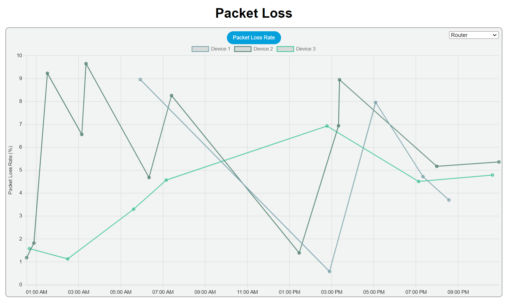

# Network Monitoring Dashboard

## Overview

The Network Monitoring Dashboard is a web-based application designed to provide real-time insights into the health and performance of devices within a network. It offers a user-friendly interface with visualizations for various network metrics, allowing users to monitor and analyze the network's status.

## Table of Contents

- [Overview](#overview)
- [Features](#features)
- [Dashboard](#dashboard)
- [All Devices](#all-devices)
- [Real-time Network Traffic](#real-time-network-traffic)
- [Alert Table](#alert-table)
- [Health Metrics](#health-metrics)
  - [Packet Loss](#packet-loss)
  - [Throughput](#throughput)
  - [Latency](#latency)
  - [Uptime](#uptime)
- [Installation](#installation)
- [Usage](#usage)
- [File Structure](#file-structure)
- [Dependencies](#dependencies)
- [Contributing](#contributing)
- [License](#license)

## Features

- Real-time visualization of network metrics.
- Device-specific details including Throughput, Uptime, Latency, and Packet Loss.
- Interactive charts for a better understanding of historical data.
- Device filtering options for customized analysis.
  
## Dashboard

The dashboard (index) page serves as the main interface for monitoring and managing the network. It provides a comprehensive overview of various aspects of the network's performance and health. The dashboard image looks like the below:


## Sidebar

The sidebar serves as a navigation hub, providing quick access to individual charts for in-depth analysis. Each link corresponds to a specific chart category. Additionally, at the end of the sidebar, you'll find a link to the developer's profile website.

## Device Status Overview (Doughnut Chart)

The Doughnut chart provides a quick and intuitive overview of the online status of different devices in the network. It represents the count of devices falling into categories such as "Online" and "Offline" for each device type, including routers, switches, and servers.

### Key Features

- **Visual Representation:** The Doughnut chart visually represents the distribution of online and offline devices using distinct colors for easy identification.

- **Device Types:** The chart categorizes devices into types such as routers, switches, and servers, allowing users to see the status breakdown for each device category.

### How to Read the Chart

- Each portion of the Doughnut represents a device type (e.g., Router, Switch, Server).
- The inner circle shows the count of devices that are currently online.
- The outer circle represents the count of devices that are offline.
- The chart dynamically updates as the online status of devices changes.

### Interpretation

- A quick glance at the Doughnut chart allows users to assess the overall health of the network by understanding the distribution of online and offline devices across different types.

### Example Usage


In this example, the chart indicates that a majority of routers and switches are online, while a few servers are currently offline. This insight can prompt further investigation into the offline servers for maintenance or troubleshooting.
  

## All Devices

The "All Devices" section provides a comprehensive overview of all devices within the network. The information is displayed in a horizontally scrollable format using the Flickity library, offering a user-friendly and visually appealing interface.

### Key Features

- **Horizontal Scroll:** Devices are presented in a horizontal scroll, making it easy for users to navigate through the list of devices.

- **Device Information:** Hovering over a device image reveals essential information such as the device name, IP address, and status.

- **Individual Dashboards:** Clicking on a device image redirects the user to an individual dashboard, where detailed information about the selected device is available. The dashboard includes sections on health, traffic, and alerts.

### How to Navigate

1. **Horizontal Scroll:** Use the horizontal scroll feature to explore all devices within the network.

2. **Hover Over Device:** Hover over a device image to display brief information, including the device name, IP address, and status.

3. **Click on Device:** Click on a device image to access the individual dashboard, providing in-depth insights into the health, traffic, and alerts specific to the selected device.

### Example Snapshot


The snapshot above illustrates the "All Devices" section, showcasing devices with their respective images. Hovering over the device provides quick details, while clicking on a device image navigates to its individual dashboard for more detailed information.

## Individual Device Details

The "Individual Device Details" section in the dashboard provides comprehensive information about each device in the network. These details are accessible through a visually appealing and interactive interface.


## Real-Time Network Traffic

The "Real-Time Network Traffic" section provides a dynamic representation of network traffic using bar charts. It displays both inbound and outbound traffic for each device, measured in kilobits per second (kbps). This real-time visualization helps users monitor the data flow across different devices within the network.

### Key Features

- **Bar Chart:** Utilizes a bar chart to visually represent the inbound and outbound traffic for each device.

- **Inbound and Outbound Traffic:** Displays separate bars for inbound and outbound traffic, allowing users to distinguish between data entering and leaving each device.

- **Dynamic Updates:** The chart is updated in real-time, providing a live view of the network traffic status.

### How to Interpret

1. **Device Selection:** The chart includes bars for each device, with distinct colors for inbound and outbound traffic.

2. **Traffic Values:** The height of each bar represents the magnitude of traffic, measured in kilobits per second (kbps).

### Example Snapshot


The snapshot above demonstrates the "Real-Time Network Traffic" section, displaying a bar chart with inbound and outbound traffic for each device.

## Alert Table

The "Alert Table" section provides a comprehensive overview of alerts generated by each device in the network. It displays essential information such as alert ID, device ID, message, status complexity, and review status. Users can also filter alerts based on their status for better analysis.

### Key Features

- **Tabular Representation:** Alerts are presented in a table format, allowing users to view multiple details at a glance.

- **Filtering Options:** Users can filter alerts based on different criteria such as "Active," "Solved," "Critical," "Warning," "Active & Critical," "Active & Warning," "Solved & Critical," "Solved & Warning," and "All."

- **Status Complexity:** Indicates the level of complexity associated with each alert, helping users prioritize and address critical issues promptly.

- **Review Status:** Specifies whether an alert is currently active or has been solved.

### How to Use

1. **Filter Alerts:** Utilize the dropdown menu to select a specific status or complexity level for filtering alerts.

2. **Table Columns:** The table includes columns for Alert ID, Device ID, Message, Status Complexity, and Review Status.

3. **Status Complexity Legend:** Understand the severity of alerts by referring to the legend for status complexity.

### Example Snapshot


The snapshot above illustrates the "Alert Table" section, showcasing a table with various alert details.

## Health Monitor

The "Health Monitor" block provides a holistic view of the network's health by monitoring four crucial parameters: Packet Loss Rate, Throughput, Latency, and Uptime. Each parameter is visualized through a dedicated graph for easy analysis.

### Key Parameters

1. **Packet Loss Rate:**
   - Chart: Line chart representing the packet loss rate over time.
   - Legend: Differentiates devices based on their packet loss rates.

2. **Throughput:**
   - Chart: Line chart displaying the network throughput (Mbps) trends.
   - Legend: Highlights variations in throughput for different devices.

3. **Latency:**
   - Chart: Scatter plot showcasing latency (ms) for each device.
   - Color-Coding: Devices are color-coded based on acceptable or high latency.

4. **Uptime:**
   - Chart: Bar chart illustrating the average uptime percentage for each device.
   - Color-Coding: Devices are color-coded for quick identification of uptime status.

### How to Use

1. **Select Devices:**
   - Utilize dropdown menus to choose specific device types for analysis.

2. **Graph Interaction:**
   - Interact with graphs to understand the historical performance of devices.

3. **Color Coding:**
   - Pay attention to color coding in charts for quick identification of device status.

### Example Snapshot


The snapshot above provides a glimpse of the "Health Monitor" block, showcasing visualizations for Packet Loss Rate, Throughput, Latency, and Uptime.

## Packet Loss Rate

The "Packet Loss Rate" chart visualizes the packet loss rate for each device over time, providing insights into network stability. The chart employs a line chart representation with each device having its own dataset. The x-axis represents timestamps, and the y-axis represents the packet loss rate in percentage.

### Key Features

1. **Line Chart:**
   - Displays the packet loss rate trends over time for individual devices.
   - Smoothly connects data points to visualize patterns and anomalies.

2. **Device Filtering:**
   - Dropdown menu enables the selection of specific device types (Switch, Router, Server).
   - Choose a combination or view all devices for comprehensive analysis.

### How to Use

1. **Select Device Type:**
   - Utilize the dropdown menu to choose specific device types or a combination.

2. **Interactive Chart:**
   - Hover over data points to view detailed information at specific timestamps.
   - Zoom in/out for a closer look at specific time ranges.

### Example Snapshot



The snapshot above showcases the "Packet Loss Rate" chart with multiple devices represented by distinct lines.

## Throughput

The "Throughput" chart visualizes the throughput of each device over time, providing insights into network data transfer rates. The chart utilizes a line chart representation with each device having its own dataset. The x-axis represents timestamps, and the y-axis represents the throughput in Mbps.

### Key Features

1. **Line Chart:**
   - Displays the throughput trends over time for individual devices.
   - Smoothly connects data points to visualize variations in data transfer rates.

2. **Device Filtering:**
   - Dropdown menu enables the selection of specific device types (Switch, Router, Server).
   - Choose a combination or view all devices for comprehensive analysis.

### How to Use

1. **Select Device Type:**
   - Utilize the dropdown menu to choose specific device types or a combination.

2. **Interactive Chart:**
   - Hover over data points to view detailed information at specific timestamps.
   - Zoom in/out for a closer look at specific time ranges.

### Example Snapshot


The snapshot above showcases the "Throughput" chart with multiple devices represented by distinct lines.

## Latency

The "Latency" chart visualizes the latency of each device over time using a scatter chart. It provides insights into the response time of devices in the network. Each device is represented by a point on the chart, with the x-axis representing timestamps and the y-axis representing latency in milliseconds (ms).

### Key Features

1. **Scatter Chart:**
   - Represents latency data points for each device.
   - Points are color-coded to indicate latency status: red for latency > 50ms, green for latency <= 50ms.

2. **Device Filtering:**
   - Dropdown menu allows the selection of specific device types (Switch, Router, Server) or a combination.

### How to Use

1. **Select Device Type:**
   - Utilize the dropdown menu to choose specific device types or a combination.

2. **Interactive Chart:**
   - Hover over points to view detailed information, including device ID, latency, and timestamp.
   - Identify devices with latency issues based on color-coding.

### Example Snapshot


The snapshot above showcases the "Latency" scatter chart with devices color-coded based on latency status.

## Uptime

The "Uptime" chart displays the average uptime of each device using a bar chart. It calculates the average uptime based on historical data, and each device is represented by a bar. The color of the bars indicates the status of the uptime: red for average uptime < 50%, and green for average uptime >= 50%.

### Key Features

1. **Bar Chart:**
   - Represents the average uptime for each device.
   - Bars are color-coded to indicate uptime status: red for uptime < 50%, green for uptime >= 50%.

2. **Device Filtering:**
   - Dropdown menu allows the selection of specific device types (Switch, Router, Server) or a combination.

### How to Use

1. **Select Device Type:**
   - Utilize the dropdown menu to choose specific device types or a combination.

2. **Interactive Chart:**
   - Hover over bars to view detailed information, including device ID and average uptime.
   - Easily identify devices with low average uptime based on color-coding.

### Example Snapshot


The snapshot above showcases the "Uptime" bar chart with devices color-coded based on average uptime status.

## Prerequisites

Before you begin, ensure you have met the following requirements:

- Java 11 or higher
- Maven
- Your preferred IDE (IntelliJ IDEA recommended)
- Localhost database (e.g., XAMPP) for development

## Installation

1. **Clone the repository:**

   ```bash
   git clone https://github.com/your-username/network-dashboard.git


### Open the project in your IDE:

Open the project using your preferred IDE. If you are using IntelliJ IDEA, open the project by selecting the pom.xml file.

### Configure Database:

Set up your localhost database (e.g., MySQL) and update the application.properties file in the src/main/resources directory with your database configurations.

### Build and Run:

Build and run the project using Maven:

    mvn clean install
    mvn spring-boot:run

Access the Dashboard:
Open your web browser and go to http://localhost:8080 to access the Network Dashboard.

## Usage

This network dashboard provides a comprehensive view of the network's health, real-time traffic, alerts, and individual device details. Below are the key features and instructions on how to use the dashboard:

### 1. Dashboard Overview:

- The dashboard presents an overview of the network's key parameters, including health, real-time traffic, alerts, and individual device details.

### 2. All Devices Section:

- **Horizontal Carousel:** Displays all devices in the network horizontally with images. Hovering over an image reveals basic information, and clicking on it navigates to an individual dashboard with detailed insights.

### 3. Real-Time Network Traffic:

- **Bar Chart:** Shows real-time inbound and outbound traffic for each device in kilobits per second (kbps).

### 4. Alert Table:

- **Table View:** Lists all alerts for each device, including complexity, review status, and messages. Users can filter alerts by status.

### 5. Health Monitor:

- **Packet Loss Rate:** Line chart depicting each device's packet loss rate over time, with filtering options.
- **Throughput:** Line chart showing each device's throughput in megabits per second (Mbps), with filtering options.
- **Latency:** Scatter chart illustrating each device's latency in milliseconds, color-coded for easy interpretation.
- **Uptime:** Bar chart displaying the average uptime for each device, with color-coding for quick assessment.

### 6. Individual Device Details:

- Each device has its own dashboard with health, traffic, and alert information for detailed analysis.

### 7. Dependencies:

- Ensure the required dependencies, including Flickity, Moment.js, Chart.js, and Spring Boot, are properly linked and configured.

### 8. Development Environment:

- Use IntelliJ IDEA for Java development and XAMPP as a local server environment for testing.

### How to Run:

1. Clone the repository.
2. Open the project in IntelliJ IDEA.
3. Configure and start the Spring Boot application.
4. Access the dashboard through a web browser.


## Dependencies

The project utilizes a variety of tools and technologies to create a dynamic and feature-rich network dashboard. Below are the key dependencies and tools used in this project:

1. **Front-End Dependencies:**
   - [Flickity](https://flickity.metafizzy.co/): A responsive carousel library for horizontal image display.
   - [Moment.js](https://momentjs.com/): A JavaScript library for parsing, validating, manipulating, and formatting dates.

2. **Charting Libraries:**
   - [Chart.js](https://www.chartjs.org/): A simple yet flexible JavaScript charting library for interactive charts.
   - [Chart.js Adapter for Moment.js](https://github.com/chartjs/chartjs-adapter-moment): An adapter for using Moment.js with Chart.js for time-based charts.

3. **Styling:**
   - Custom CSS stylesheets for responsive and visually appealing user interfaces.

4. **Back-End Dependencies:**
   - [Spring Boot](https://spring.io/projects/spring-boot): A Java-based framework for creating stand-alone, production-grade Spring-based Applications.

5. **Development Environment:**
   - [IntelliJ IDEA](https://www.jetbrains.com/idea/): A popular integrated development environment (IDE) for Java development.
   - [XAMPP](https://www.apachefriends.org/index.html): A cross-platform web server solution that includes Apache, MySQL, PHP, and Perl.

### How to Install Dependencies

1. **Front-End:**
   - Link the Flickity and Moment.js libraries in the HTML files.
   - Include the Chart.js and Chart.js Adapter for Moment.js scripts in the HTML files.
   - Add custom CSS stylesheets for styling.

2. **Back-End:**
   - Set up a Spring Boot project using IntelliJ IDEA.
   - Configure the project to use the H2 Database or another preferred database.
   - Install required dependencies through Maven or Gradle.

3. **Development Environment:**
   - Install IntelliJ IDEA for Java development.
   - Set up XAMPP for a local web server environment.

## License

This project is licensed under the [MIT License](https://opensource.org/licenses/MIT) - see the [LICENSE](LICENSE) file for details.


